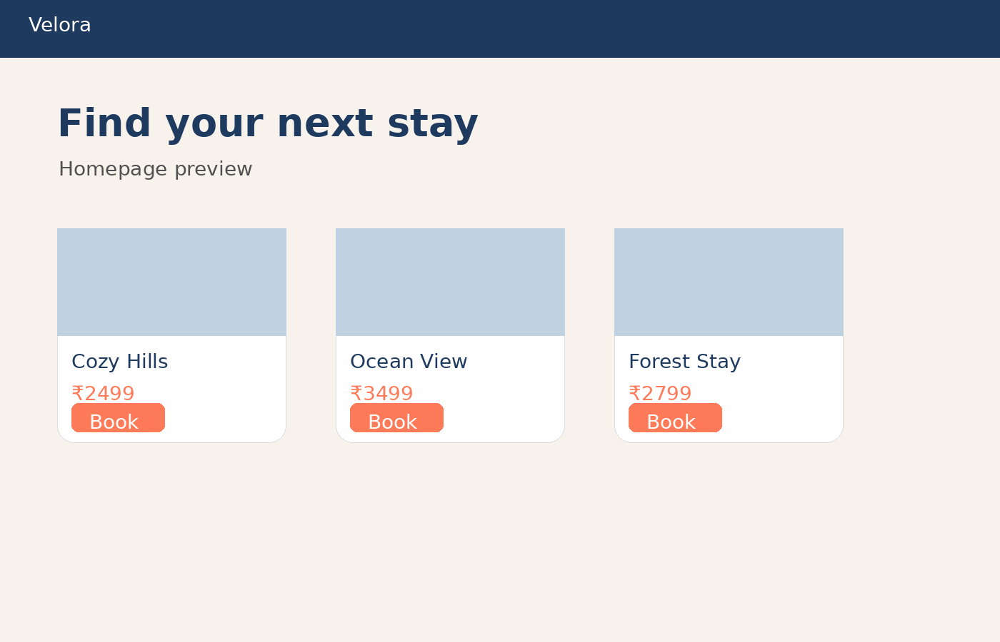
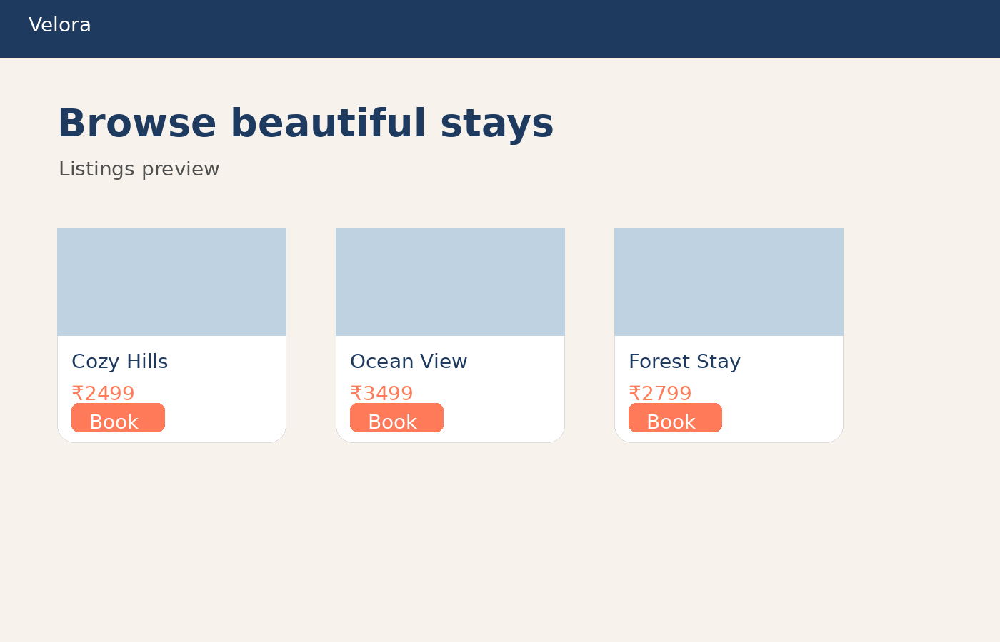
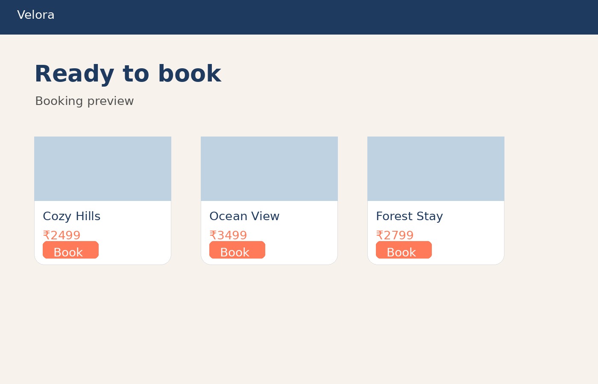

# Velora

A small travel-stay booking site built with Express and EJS. Browse stays, sign up, log in, and book a stay with dates and guest count.



## Features

- Home page with featured stays
- Full stays listing page
- Listing detail page with a booking form
- Signup / login / logout (sessions, hashed passwords)
- Booking requires login; you're sent to login and back to the listing you wanted afterward
- Booking confirmation page with a ticket-style summary
- Custom 404 page
- Responsive layout (mobile nav)

## Getting started

```bash
npm install
cp .env.example .env   # then edit .env if you want
npm start
```

Open **http://localhost:3000**.

For auto-reload during development:

```bash
npm run dev
```

## Environment variables

See `.env.example`. `SESSION_SECRET` should be a long random string in any real deployment — the fallback in the code is for local development only.

## Data

Stays and users are stored **in memory** (`data/hotels.js`, `data/users.js`) so the app runs with zero setup. Data resets whenever the server restarts. To persist data, swap those two files for a real database (e.g. MongoDB with Mongoose) — the rest of the app (routes, views) doesn't need to change, only the functions each module exports.

## Project structure

```
Velora/
├── app.js                 # app setup, middleware, routes mounted here
├── routes/
│   ├── index.js            # home, /stays
│   ├── auth.js              # /login, /signup, /logout
│   └── booking.js           # listing detail, /stays/:id/book, confirmation
├── middleware/
│   └── auth.js              # attachUser, requireLogin
├── data/
│   ├── hotels.js             # in-memory stays + bookings
│   └── users.js               # in-memory users
├── views/
│   ├── partials/               # navbar, footer
│   └── *.ejs                    # pages
├── public/
│   ├── css/style.css
│   └── js/main.js
└── .env.example
```

## Fixes made to the original version

See the pull request / commit history, or ask the assistant that generated this project — the short version is: added missing routes and pages that the nav promised (Stays, Login, booking flow), added authentication, added form validation and error states, fixed a broken `.env.example` that was never actually read by the app, added a `.gitignore` so secrets and `node_modules` don't get committed, and gave the site a full page set (listing detail, confirmation, login, signup, 404) instead of only a homepage.

## Screenshots

| Home | Listings | Booking |
|---|---|---|
|  |  |  |

## License

For personal/learning use.
